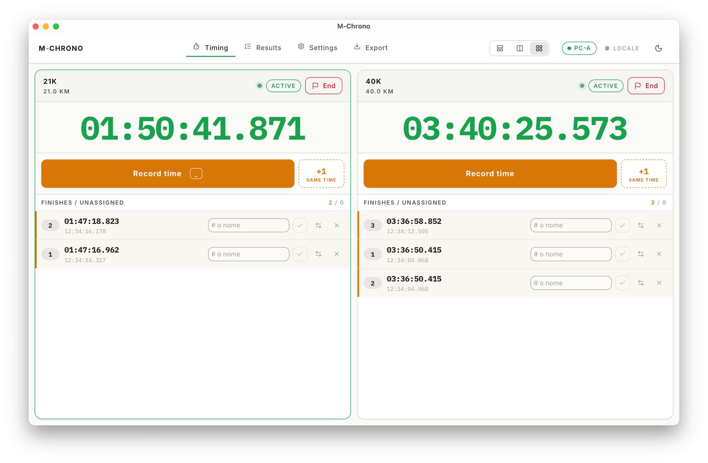

# M-Chrono

[](https://github.com/Lorenzo-DM/M-Chrono.rs/actions/workflows/ci.yml)
[](LICENSE)

Desktop chronometry app for trail running races, built with **Tauri 2**,
**Svelte 5**, and **Rust**.

M-Chrono is offline-first: every timing event is captured locally and persisted
to SQLite, so the app keeps working with no network. When connectivity is
available it syncs bidirectionally with a race API, deduplicating events
captured by two operators running in parallel. Results export to XLSX and CSV.

## Features

- **Precise timing** — start/finish capture with a monotonic clock, multiple
  timing lanes, and per-athlete splits.
- **Offline-first** — local SQLite store; no data loss without network.
- **Dual-operator sync** — two desktops time the same race; events merge with a
  sliding-window dedup that flags suspicious deltas for manual review.
- **Bib management** — assign, reassign, and import athlete/bib lists.
- **Checkpoints** — intermediate timing points along the course.
- **Export** — XLSX and CSV results.
- **Import** — athlete rosters from spreadsheets (XLSX/CSV).
- **Auth** — OIDC device-code flow against any standards-compliant provider;
  tokens in the OS keychain.
- **i18n** — Italian (default) and English, switchable at runtime.

## Architecture

```
src/                  Svelte 5 frontend (UI, stores, i18n)
  lib/components/      Race setup, workspace, results, export, settings
  lib/i18n/            Locale system (it, en)
src-tauri/src/         Rust backend
  timer/               Monotonic clock + timing events
  db/                  SQLite repo + migrations
  auth/                OIDC discovery, device-code + refresh, keychain store
  sync/                Pull/push + dedup against the race API
  api/                 Authenticated HTTP client
  export/              XLSX + CSV writers
  import/              Roster import
```

## Screenshots



Two courses timed in parallel. Each lane keeps its own monotonic clock; finishes
are captured first and matched to a bib afterwards, so the operator never has to
type while runners are crossing.

## Requirements

- Rust stable (>= 1.78)
- Node.js >= 20
- [bun](https://bun.sh) (package manager; not pnpm/npm)
- macOS, Linux, or Windows
- An OIDC provider with a public/native client that supports the Device
  Authorization Grant (RFC 8628) and issues refresh tokens

## Development

```bash
bun install
bun run tauri dev
```

## Build

```bash
bun run tauri build
```

Artifacts land under `src-tauri/target/release/bundle/`.

## Configuration

First launch writes `config.json` under the OS app data dir
(`com.mchrono.app`):

- macOS: `~/Library/Application Support/com.mchrono.app/`
- Linux: `~/.local/share/com.mchrono.app/`
- Windows: `%APPDATA%\com.mchrono.app\`

Configure via the Settings UI or directly in `config.json`:

| Key                   | Meaning                                              | Default |
| --------------------- | ---------------------------------------------------- | ------- |
| `oidc_issuer_url`     | OIDC issuer, e.g. `https://idp.example.com`          | —       |
| `oidc_client_id`      | Native client ID                                     | —       |
| `oidc_scopes`         | `openid profile email offline_access ...`            | —       |
| `api_base_url`        | race API root                                        | —       |
| `operator_id`         | unique label per desktop (e.g. `PC-A`, `PC-B`)       | —       |
| `sync_enabled`        | enable background cloud sync                          | `false` |
| `sync_interval_secs`  | background sync cadence                              | `10`    |
| `dedup_window_ms`     | sliding window for duplicate grouping                | `2000`  |
| `dedup_warn_delta_ms` | flag threshold within a dedup group                  | `500`   |

The refresh token is stored in the OS keychain. Access tokens live in memory
only.

## OIDC provider setup

Endpoints are resolved at runtime from the provider's discovery document at
`<oidc_issuer_url>/.well-known/openid-configuration`, so no provider-specific
URLs are hardcoded. Any provider that publishes a `device_authorization_endpoint`
there works — Keycloak, Auth0, Okta, Entra ID, and others.

1. Create a public (native) client and enable the Device Authorization Grant.
2. Enable refresh tokens and set their lifetime to cover a race weekend
   (>= 30 days recommended, with idle expiration disabled or equally long).
3. Add the scope or audience your race API expects; mirror it in `oidc_scopes`
   alongside `offline_access`.
4. Copy the client ID into `oidc_client_id` and the issuer URL into
   `oidc_issuer_url`.

## Internationalization

UI strings live in `src/lib/i18n/locales/` (`it.ts`, `en.ts`). The locale is
resolved from `localStorage`, falling back to the system language, defaulting to
Italian. Switch languages at runtime from the Settings page.

## Tests

```bash
cargo test --manifest-path src-tauri/Cargo.toml   # Rust backend
bun run test --run                                # Svelte frontend (vitest)
```

## Logs

Daily-rotated log files are written to `<app_data_dir>/logs/race.log.<date>`.
Filter via `RUST_LOG`, e.g. `RUST_LOG=m_chrono_lib=debug`.
